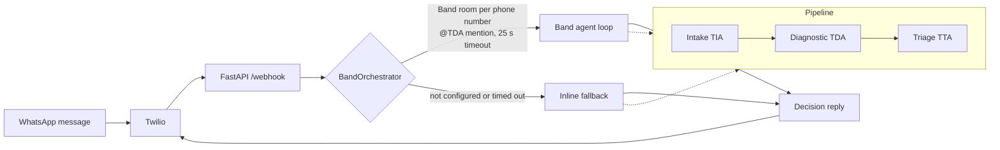
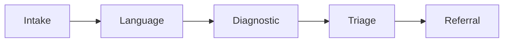

<div align="center">

# MIRA

### AI Clinical Triage for Rural India

Multi-agent decision support for ASHA workers and PHC staff, delivered over WhatsApp.


</div>

> **Origin:** This project was originally built as **TABIB** at a hackathon in June 2026, and was later renamed and rebuilt into MIRA's 5-node pipeline.

**Contents:** [Problem](#the-problem) · [Decisions](#what-it-does) · [Architecture](#architecture-this-repo) · [5-node MIRA](#mira-the-5-node-pipeline) · [Stack](#what-we-used) · [Quick start](#quick-start) · [Limits](#scope-and-limits)

---

## The Problem

India has 900,000+ ASHA (Accredited Social Health Activist) workers serving rural communities where the nearest doctor is hours away. When a patient presents with fever, rash, or chest pain, ASHA workers have no decision support. They guess. Patients die from delayed referrals for treatable conditions like dengue hemorrhagic fever.

MIRA puts a clinical triage system in their hands, in Hindi, Telugu and English, with zero training required.

## What It Does

An ASHA worker describes a patient in plain language on WhatsApp. Three specialized Claude agents coordinate to return a structured decision:

| | Decision | Meaning |
|---|---|---|
| ✅ | **MONITOR AT HOME** | Safe to manage locally, with instructions |
| ⚠️ | **REFER TODAY** | Needs facility care within hours |
| 🚨 | **REFER NOW** | Do not delay: emergency escalation |

The reply follows a fixed format, so it is easy to read on a small phone screen:

```
🏥 MIRA Assessment

Decision: [REFER NOW / REFER TODAY / MONITOR AT HOME]

Next steps:
• ...

⚠️ Watch for these warning signs:
• ...

Tell the doctor:
"<one-line clinical summary for the PHC doctor>"
```

## Architecture (this repo)



Each agent is one `anthropic` Messages API call (`claude-sonnet-4-5`) with a prompt from `shared_prompts/prompts.py`.

| # | Agent | File | Input → Output |
|---|---|---|---|
| 1 | **Intake (TIA)** | `src/intake_agent.py` | Raw WhatsApp text (English / Hindi / Telugu / mixed) → structured patient JSON: age, sex, symptoms, duration, vitals, pregnancy status, known conditions, language. Missing fields stay `null`; nothing is guessed. |
| 2 | **Diagnostic (TDA)** | `src/diagnostic_agent.py` | Intake JSON → top-3 differential, red flags, missing critical info, immediate ASHA actions, notes for the PHC doctor. Framed as pattern-flagging for a doctor, not diagnosis. Guided by NHM and IMNCI. |
| 3 | **Triage (TTA)** | `src/triage_agent.py` | Intake + diagnostic → the final WhatsApp reply with the `Decision:`, next steps, warning signs and a doctor summary, in the patient's language. |

**How the two paths work**

- **Band agent loop** (`src/band_orchestrator.py`): one persistent Band room per patient phone number, TDA and TTA added as participants, completion detected by the `Decision:` keyword. Tagged `[path=band_agent_loop]`.
- **Inline fallback** (`src/band_coordinator.py`): if Band is not configured or the loop times out, the same three agents run in-process. Tagged `[path=inline_fallback]`. The patient always gets an answer.
- **WhatsApp bridge** (`src/band_whatsapp_bridge.py`, `src/webhook.py`): FastAPI webhook with Twilio send/receive and a `/` health check that reports Band reachability.
- Design notes and the Band SDK API findings are in [`TIER3_PLAN.md`](TIER3_PLAN.md).

## MIRA: the 5-node pipeline

After the hackathon the project was renamed MIRA and rebuilt as a fixed, auditable pipeline. That code lives in a separate repository; it is not part of this one.



| # | Node | Role |
|---|---|---|
| 1 | **Intake** | Extracts structured symptoms. Refuses to continue without age, sex and the primary symptom's duration or severity, and asks a clarifying question instead. |
| 2 | **Language** | Detects the patient's language and maps symptoms to a canonical tag vocabulary, then translates the result back at the end. English, Hindi, Marathi, Tamil, Telugu, Gujarati. |
| 3 | **Diagnostic** | A bounded differential from a fixed taxonomy, used only to estimate urgency. Grounded in retrieval over IMNCI / NHM / WHO CHW protocol text. Never patient-facing. |
| 4 | **Triage** | A hardcoded red-flag rule engine runs first, and any hit forces EMERGENCY regardless of the LLM. Otherwise the LLM's grounded assessment is used, escalated one band up if confidence is low. |
| 5 | **Referral** | Maps the triage level to a facility type by deterministic lookup, with next steps passed through a drug-name and dosage filter. |

MIRA also adds a romanization normalizer for Latin-script Telugu and Hindi, and a doctor-handoff WhatsApp message on emergency or urgent cases. It is described as a verifiable workflow automator with LLM reasoning at bounded checkpoints, not as autonomous agents.

## What We Used

| Layer | Tech |
|---|---|
| LLM | Anthropic Claude (`claude-sonnet-4-5` in this repo) via the `anthropic` SDK |
| Agent coordination | Band (`band-sdk[anthropic]`): chat rooms, @mentions, agent REST API |
| Messaging | WhatsApp through Twilio |
| API server | FastAPI + Uvicorn |
| Config | `python-dotenv` (keys live in `.env`, which is gitignored) |
| Languages | English, Hindi, Telugu |
| Guidelines | NHM and IMNCI (prompt guidance in this repo) |

## Quick Start

```bash
pip install -r requirements.txt
# create .env in the repo root with the variables below
cd src && uvicorn webhook:app --port 8000
```

| Variable | Needed for |
|---|---|
| `ANTHROPIC_API_KEY` | all agents |
| `TWILIO_ACCOUNT_SID`, `TWILIO_AUTH_TOKEN`, `TWILIO_WHATSAPP_FROM` | WhatsApp send/receive |
| `BAND_AGENT_API_KEY`, `BAND_AGENT_ID` | Band orchestration |
| `BAND_TDA_ID`, `BAND_TTA_ID` (optional) | enables the Band agent loop; without them the inline fallback is used |

Tests: `src/test_band_orchestrator.py`, `src/test_whatsapp_bridge.py`, `src/test_tabib.py`.

## Repository Layout

```
src/
  intake_agent.py  diagnostic_agent.py  triage_agent.py   the 3 agents
  band_orchestrator.py  band_whatsapp_bridge.py            Band room + bridge
  band_coordinator.py                                      inline fallback pipeline
  webhook.py                                               FastAPI + Twilio
  test_*.py                                                tests
shared_prompts/prompts.py                                  all agent prompts
TIER3_PLAN.md                                              Band bridge design notes
```

## Scope and Limits

This is decision support for trained ASHA workers and PHC staff. It is not a diagnostic tool and not a substitute for medical advice, and it has not been clinically validated.

## History

Built as TABIB at the Band of Agents Hackathon (Track 3: Regulated & High-Stakes Workflows), June 2026. The git history was rewritten to remove credentials that were committed early on. Those keys were rotated.
